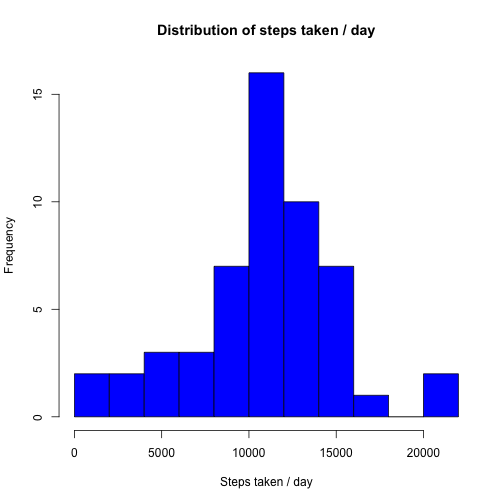
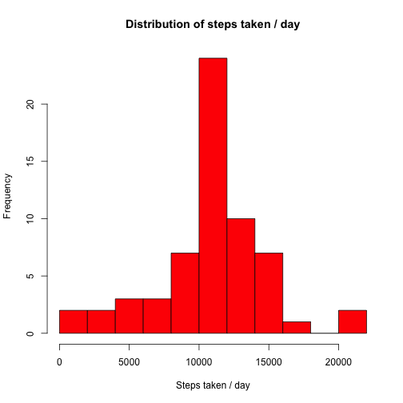
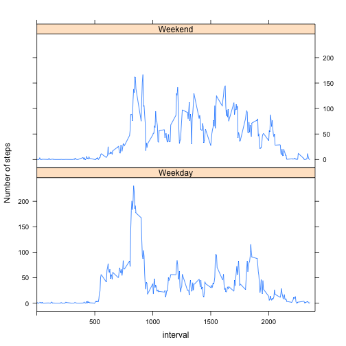

#Peer Assessment 1
Coursera - Reproducible Research
Daniel Pedraza 


##Loading Data
In order to load the data we need to run the following:

```r
setwd("~/Documents/Personal/Coursera/DataScience_Specialization/Reproducible_Research")
activity <- read.csv("activity.csv")
```

##Total number of steps taken per day
 


```r
options(digits = 2)
library(dplyr)
daily_activity <- group_by(activity, date)
total_steps_day <- summarise(daily_activity, daily_steps = sum(steps, na.rm = TRUE))
mean_steps_day <- mean(total_steps_day$daily_steps)
median_steps_day <- median(total_steps_day$daily_steps)
```
The **mean/median** total number of steps taken per day is: **9354.23** and **10395** respectively.

##Average daily activity pattern
We will now plot the average daily activity pattern:

```r
average_daily_activity <- aggregate( steps~interval, activity, mean, na.rm = TRUE)
plot(average_daily_activity, type = "l", main = "Average Daily Activity Pattern")
```

 


```r
most_active_interval <- average_daily_activity[which(average_daily_activity$steps == max(average_daily_activity$steps)),1]
```
The 5-minute interval with the maximum number of steps on average average across all the days is: **835**  

##Input Missing Values
Calculate how many missing values we have:

```r
missing_values <- sum(is.na(activity))
```
The total number of missing values in the dataset is **2304**

In order to remove missing values we will replace them with the mean of the average daily pattern:

```r
period_activity <- group_by(activity, interval)
average_steps_period <- summarise(period_activity, average_steps = mean(steps, na.rm = TRUE))
keep <- complete.cases(activity$steps)
clean_activity <- data.frame(activity,keep, average_steps_period)
clean_activity$steps <- as.numeric(clean_activity$steps)
clean_activity_DT <- as.data.table(clean_activity)
new_activity <- clean_activity_DT[keep==FALSE, steps := (average_steps)]
```
Make a histogram of the total number of steps taken each day: 

```r
options(scipen = 1, digits = 2)
new_steps_day <- aggregate( steps~date, new_activity, sum, na.rm = TRUE)
hist(new_steps_day$steps, xlab = "Steps taken / day", main = "Distribution of steps taken / day", col = "red", breaks = 10)
```

 

```r
new_daily_activity <- group_by(new_activity, date)
total_steps_day <- summarise(new_daily_activity, daily_steps = sum(steps, na.rm = TRUE))
new_mean_steps_day <- mean(total_steps_day$daily_steps)
new_median_steps_day <- median(total_steps_day$daily_steps)
```
The new **mean/median** total number of steps taken per day for the edited dataset is: **10766.19** and **10766.19**. Our strategy for filling in missing values has slightly increased both the mean/median of the dataset. Nevertheless, I believe the data has not been corrupted by our handling of missing values.

##Differences in activity patterns weekday vs. weekend
We firstly create a new factor variable indicating whether a given date is a **weekday** or **weekend day**.

```r
new_activity$dow<- weekdays(as.Date(new_activity$date))
new_activity$weekdays <- factor(ifelse((new_activity$dow=="Saturday") | (new_activity$dow=="Sunday"), "Weekend", "Weekday"))
```

We now use our factor variable to make a panel plot (using the Lattice package) to highlight the activity difference between weekdays and the weekend. Again, we are looking at the 5-minute interval and the average number of steps taken, averaged across all **weekday/weekend** days:


```r
new_activity$dow<- weekdays(as.Date(new_activity$date))
new_activity$weekdays <- factor(ifelse((new_activity$dow=="Saturday") | (new_activity$dow=="Sunday"), "Weekend", "Weekday"))
average_daily_activity_comparison <- aggregate( steps~interval+weekdays, new_activity, mean, na.rm = TRUE)
xyplot(steps~interval|weekdays,average_daily_activity_comparison, type = "l", layout=c(1,2), xlim =c(0,2400), ylab = "Number of steps")
```

 
